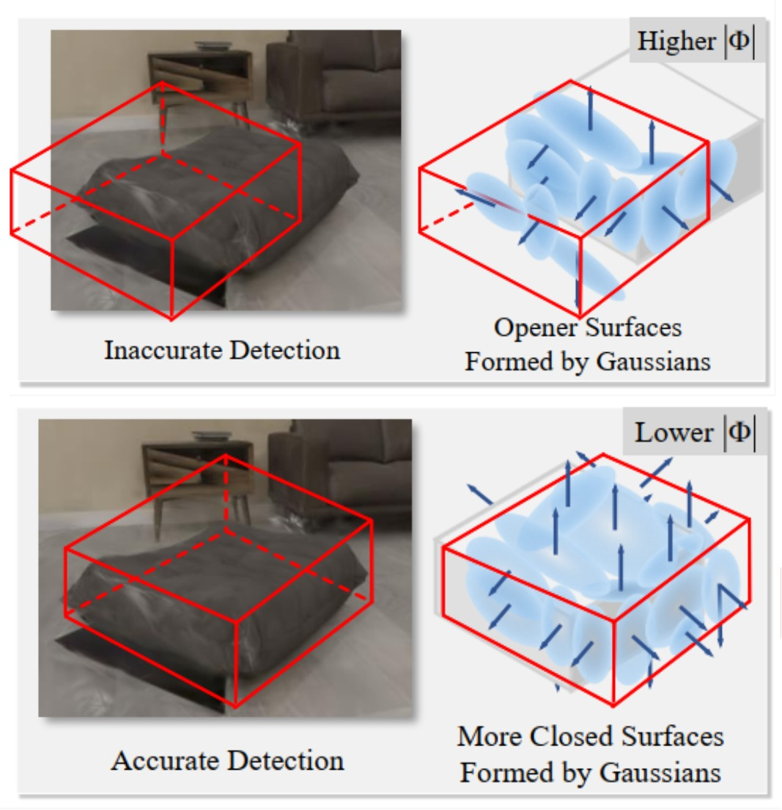
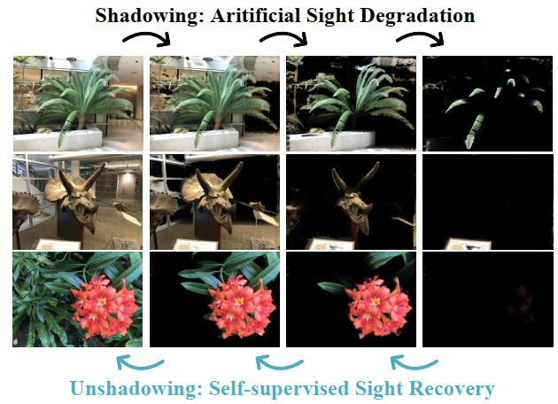

I'm a senior undergraduate student from Tsinghua University. My research interests are scene reconstruction, understanding and AIGC. I got GPA 3.95/4.00, ranked 2 in the major. Previously, I was fortunate to be advised by [Prof. Yueqi Duan](https://duanyueqi.github.io) at Tsinghua University and [Prof. Zhuowen Tu](https://pages.ucsd.edu/~ztu/) at University of California, San Diego. I was also a research intern at Microsoft Research Asia in 2025. I am actively seeking for Ph.D position!

You can find my CV here: [Curriculum Vitae](../assets/CV.pdf)

[Email](yanhongru2003@gmail.com) / [Github](https://github.com/HongruYan2003)

News
=====
* **2025.1.23** One Paper is Accepted by **ICLR2025**!

Publications 
======
<table style="width:100%;border:0px;border-spacing:0px;border-collapse:separate;margin-right:auto;margin-left:auto;">
  <tr>
    <td style="width: 200px; vertical-align: top;">
      
    </td>
    <td style="vertical-align: top; padding-left: 12px;">
      <b>Hongru Yan*</b>, Yu Zheng*, Yueqi Duan.  
      <b>Gaussian-Det: Learning Closed-Surface Gaussians for 3D Object Detection</b>  
      <i>ICLR 2025</i>  
      [<a href="https://arxiv.org/pdf/2410.01404.pdf">Paper</a>] ·
      [<a href="https://arxiv.org/pdf/2410.01404">ArXiv</a>] ·
      [<a href="https://yzheng97.github.io/Gaussian-Det/">Project Page</a>]
    </td>
  </tr>
</table>

<table>
  <tr>
    <td style="width: 32%;"></td>
    <td style="width: 68%; vertical-align: top; padding-left: 12px;">
      <b>Hongru Yan</b>, Zeyuan Chen, Xiang Zhang, Fangyin Wei, Zhuowen Tu.  
      <b>Gaussian Swaying: A Surface-Oriented Framework for Wind-Driven Dynamics with 3D Gaussians</b>  
      <i>Under Review</i>
    </td>
  </tr>
</table>

<table>
  <tr>
    <td style="width: 32%;"></td>
    <td style="width: 68%; vertical-align: top; padding-left: 12px;">
      <b>Hongru Yan*</b>, Yu Zheng*, Yueqi Duan.  
      <b>Gaussian-Det: Learning Closed-Surface Gaussians for 3D Object Detection</b>  
      <i>ICLR 2025</i>  
      [<a href="https://arxiv.org/pdf/2410.01404.pdf">Paper</a>] ·
      [<a href="https://arxiv.org/pdf/2410.01404">ArXiv</a>] ·
      [<a href="https://yzheng97.github.io/Gaussian-Det/">Project Page</a>]
    </td>
  </tr>
</table>

<table>
  <tr>
    <td style="width: 32%;"></td>
    <td style="width: 68%; vertical-align: top; padding-left: 12px;">
      Yu Zheng, Yueqi Duan, Kangfu Zheng, <b>Hongru Yan</b>, Jiwen Lu, Jie Zhou.  
      <b>OPONeRF: One-Point-One NeRF for Robust Neural Rendering</b>  
      <i>Under Review</i>  
      [<a href="https://arxiv.org/pdf/2409.20043.pdf">Paper</a>] ·
      [<a href="https://arxiv.org/pdf/2409.20043">ArXiv</a>] ·
      [<a href="https://yzheng97.github.io/OPONeRF/">Project Page</a>]
    </td>
  </tr>
</table>

<table>
  <tr>
    <td style="width: 32%;"></td>
    <td style="width: 68%; vertical-align: top; padding-left: 12px;">
      Yu Zheng, <b>Hongru Yan</b>, Yueqi Duan, Jiwen Lu.  
      <b>ShadowNeRF: Learning Neural Radiance Field with Sight Degradation and Recovery</b>  
      <i>TMM</i>
    </td>
  </tr>
</table>

* **Hongru Yan**, Zeyuan Chen, Xiang Zhang, Fangyin Wei, Zhuowen Tu. **Gaussian Swaying: A Surface-Oriented Framework for Wind-Driven Dynamics with 3D Gaussians** *Under Review*.
* **Hongru Yan\***, Yu Zheng\*, Yueqi Duan. **Gaussian-Det: Learning Closed-Surface Gaussians for 3D Object Detection** *ICLR2025* ([Paper](https://arxiv.org/pdf/2410.01404.pdf) / [ArXiv](https://arxiv.org/pdf/2410.01404)  / [Project Page](https://yzheng97.github.io/Gaussian-Det/))
* Yu Zheng, Yueqi Duan, Kangfu Zheng, **Hongru Yan**, Jiwen Lu, Jie Zhou. **OPONeRF: One-Point-One NeRF for Robust Neural Rendering** *Under Review* ([Paper](https://arxiv.org/pdf/2409.20043.pdf) / [ArXiv](https://arxiv.org/pdf/2409.20043)  / [Project Page](https://yzheng97.github.io/OPONeRF/))
* Yu Zheng, **Hongru Yan**, Yueqi Duan, Jiwen Lu. **ShadowNeRF: Learning Neural Radiance Field with Sight Degradation and Recovery** *TMM*

      
Experience
======
* Research Intern, mlPC Lab, advised by Prof. Zhuowen Tu, UCSD, 2024.06-2024.11
* Research Intern, advised by Prof. Yueqi Duan, Tsinghua University, 2023.4-2025.01
* Undergraduate student (GPA: 3.95/4.0), Tsinghua University, 2021.09 - 2025.07 

Honors and Awards
======
* **National Scholarship** (top scholarship in China; 0.2% domestically), Ministry of Education, 2024
* **Academic Excellence Scholarship**, Tsinghua University, 2024

Academic Services
======
* Conference Review: ICLR 2025
